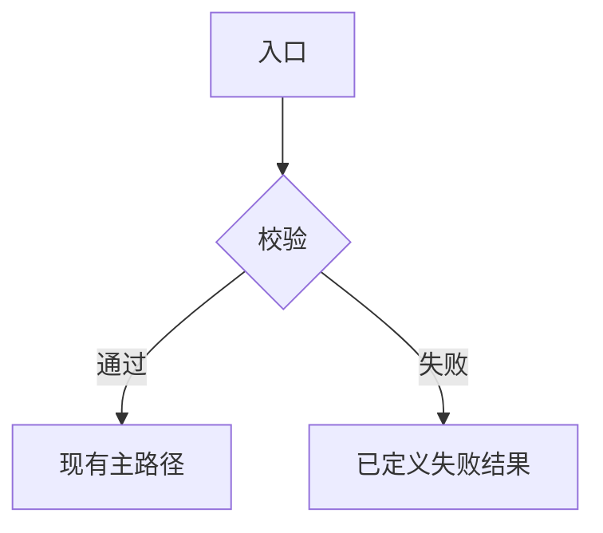

# 源码修改执行方案模板

本文件给人手工填写。`$ai-plan-doc-writer` 的权威输出骨架在 `C:\Users\41290\.pi\agent\skills\ai-plan-doc-writer\源码修改执行方案模板.md`。改一处必须改另一处。

给 AI / 工程师直接改代码用的执行方案，不是论文，也不是给人看的架构说明书。

读者假设是：**没有参加过讨论的执行者**。读完必须能判断四件事：改哪些文件、改哪些函数、不能动什么、怎样算做完。

配套流程：

```text
填写本模板 -> 人工确认范围 -> `$ai-plan-executor` 或工程师按文档执行
```

需要 AI 代填完整方案时，显式调用 `$ai-plan-doc-writer`。不要把最终生产代码写进本方案。

## 适用 / 不适用

适用：功能代码、缺陷修复、重构、UI / 服务 / 测试代码，以及改代码所必需的配置、测试或文档。

不适用：纯架构提案、纯配置、纯文档、纯排查、运维手册、无代码改动的测试计划。那些应另开文档，不要套本模板。

## 填写规则

1. 先读现有代码再填 `修改范围` 和 `函数级修改设计`。这两张表空着，方案还不能执行。
2. 六要素不要写进同一节：

   | 六要素 | 落到哪一节 |
   | --- | --- |
   | Role | `阶段角色与职责`，以及每个实现步骤开头的当前角色 |
   | TechStack | `执行约束` 里的工程规范，不写进角色 |
   | Domain | `背景与现状` 里的对象、状态、不变量 |
   | Requirement | `目标` + `需求范围` |
   | Constraints | `非目标` + `执行约束` |
   | Acceptance | `验收标准` + `代码静态校验` + `运行验证方式` |

3. 角色只使用现有 Actor 索引（全局 `C:\Users\41290\.pi\agent\Actor\README.md`，或项目 `Doc/AIPrompt/AIActor/README.md`）。没有合适角色就停，不要临时编。
4. 角色只写身份、职责、判断视角、工作方式、边界。技术栈、业务规则、本次需求、验收标准都不要写进角色。
5. `验收标准` 必须能打勾：已满足 / 未满足 / 部分满足。禁止「更清晰 / 更优雅 / 更好维护」。
6. 关键函数只写框架级伪代码：校验、分支、调用、改状态、失败、返回。不要写可编译的最终实现。
7. `运行验证方式` 必须是当前仓库能执行的命令或操作，禁止写「跑一下测试」。
8. 小修可以缩短叙述，但不可删除：`目标`、`需求范围`、`非目标`、`执行约束`、`修改范围`、`函数级修改设计`、`验收标准`、`代码静态校验`、`运行验证方式`。
9. 无新增类型时，`新增类与结构体设计` 必须写 `无新增类或结构体`，不要删节。
10. 填写完成后删除本节「填写规则」以上的说明也可以；从「方案标题」起必须完整保留给执行者。

---

# 【一句话目标，不要用优化/完善/支持单独当标题】

## 方案元信息

| 项目 | 内容 |
| --- | --- |
| 方案类型 | 功能代码开发 / 缺陷修复 / 代码重构 / UI 代码调整 / 服务代码改动 / 测试代码改动 |
| 风险等级 | 低 / 中 / 高 |
| 主要影响范围 | `path/or/module` |
| 是否允许改代码 | 是 |
| 是否允许改配置 | 是 / 否 |
| 是否允许新增测试 | 是 / 否 |
| 是否需要重启服务 | 是 / 否 / 待确认 |
| 推荐执行 skill | `ai-plan-executor` |
| 角色策略 | 仅使用现有 Actor 索引，按 `阶段角色与职责` 逐阶段切换 |

## 目标

最终可观察结果。写清输入、输出、失败时调用方或用户看到什么。

- 

## 背景与现状

写当前代码真实行为，不要写行业综述。

- 当前行为：
- 现有能力：
- 缺口：
- 关键代码 / 配置：`path` · `Type` · `function` / 配置键
- 相关业务对象、状态、不变量：

## 需求范围

只写必须做的事。每条都应可执行。

- [ ] 
- [ ] 

## 非目标

明确不许做的事。用来阻止无关重构、改协议、改权限、迁数据、扩大抽象。

- 
- 

## 执行约束

- 必须严格按本文档范围执行。
- 不允许进行方案外重构、统一格式化或无关清理。
- 不允许修改未列入修改范围的业务逻辑，除非实现步骤明确要求。
- 如果发现方案与现有代码冲突，必须先停止并说明冲突，不得自行扩大范围。
- 如果实际代码结构与方案预估文件不一致，必须先补充实际文件清单，再继续实现。
- 涉及配置、设备动作、数据库或调度逻辑时，必须保留回滚和人工验证说明。
- 技术与工程规范以当前仓库及对应 Stack 文档为准，不在角色定义里重复。
- 【按任务增补硬规则，例如禁止改公共 API、禁止引入新依赖、必须走现有错误类型】

## 阶段角色与职责

角色是阶段局部指令，不是全文总人设。每个阶段开始时切换；阶段结束后不要把该角色的视角带进下一阶段。

填写前先核对角色目录。下表默认值可改，但必须换成真实存在的索引。

| 阶段 | Role 索引 | 本阶段职责 | 输出重点 | 切换条件 |
| --- | --- | --- | --- | --- |
| 代码阅读阶段 | `developer` | 核对真实文件、调用链、冲突点 | 文件清单、调用链 | 关键代码和配置已定位 |
| 修改前确认阶段 | `developer` | 核对范围、非目标、约束仍成立 | 冲突与待确认项 | 无未决冲突，或已请示 master |
| 实现阶段 | `developer` | 按修改范围做最小改动 | 代码变更 | 代码改动完成 |
| 自检阶段 | `developer` | 对照验收标准和执行约束 | 自检表 | 自检完成 |
| 运行验证阶段 | `developer` | 执行本文指定的命令或操作 | 验证记录 | 能跑的项已跑完 |
| 静态校验阶段 | `code-requirement-verifier` | 用代码证据核对需求完成度，不改代码 | 校验报告 | 结论明确 |
| 最终交付阶段 | `developer` | 按最终交付要求汇总 | 交付清单 | 文档齐全 |

若某阶段需要结构判断、界面路径或玩法验收，再换成 `architect` / `interface` / `playtester` 等现有索引，并改写该行职责。不要为了「每个阶段名字不同」而造角色。

## 实现方案

写主路径、失败路径、状态/数据如何变化。有分叉、跨服务或状态机时再用 Mermaid。这里讲「怎么走」，不贴最终生产代码。

- 入口：
- 主路径：
- 失败路径：
- 状态 / 数据如何变：
- 配置 / 持久化 / UI 刷新（如有）：



## 修改范围

每个源文件都要落到类型和函数。没有函数时写 `不涉及函数`，并说明改的是类型、字段、导入、配置键还是文档段落。路径未知时写到模块，并在实现步骤里要求执行者先定位准确文件。

| 文件或模块 | 修改类型 | 是否必须 | 涉及类/类型 | 涉及函数 | 修改目的 |
| --- | --- | --- | --- | --- | --- |
| `path/to/file` | 修改 / 新增 / 删除 / 待确认 | 必须 / 可选 | `TypeName` | `existingFn`、`newFn`（新增） | 为什么要改 |

## 新增类与结构体设计

无新增类或结构体时保留下一句，删除后面的示例块。

无新增类或结构体

需要新增时，先填总表，再为每个类型写职责、生命周期和框架级骨架。每个可调用成员还必须出现在 `函数级修改设计`。

| 文件 | 命名空间 | 类型名称 | 类型种类 | 可见性 | 基类/接口 | 核心职责 | 新增原因 |
| --- | --- | --- | --- | --- | --- | --- | --- |
| `path/to/NewType.ts` | `module.path` | `NewType` | class / struct / type | public / internal | `Base` / 无 | 单一职责 | 为什么不能复用现有类型 |

#### `path/to/NewType.ts` — `NewType`

- 类型：class / struct / type
- 职责：
- 使用方：谁创建、持有、调用
- 生命周期：singleton / scoped / transient / value object / 手工管理
- 新增原因：

```text
type NewType
    dependencies:
        verified dependency contracts
    state:
        fields and ownership
    construction:
        inputs and invariants
    public surface:
        methods and responsibilities
    private helpers:
        helper names and boundaries
```

## 函数级修改设计

现有函数和新增函数分开。重载必须写完整签名。每个函数都能回溯到 `修改范围` 中的文件。

| 文件 | 类/类型 | 函数或成员 | 变更类型 | 建议签名 | 职责 | 调用关系 |
| --- | --- | --- | --- | --- | --- | --- |
| `path/to/file` | `TypeName` | `existingFn` | 修改现有函数 | `ReturnType existingFn(Args)` | 修改后的职责 | 由谁调用、调用谁 |
| `path/to/file` | `TypeName` | `newFn` | 新增函数 | `ReturnType newFn(Args)` | 新函数职责 | 由谁调用、调用谁 |

#### `path/to/file` — `TypeName.existingFn`

- 变更类型：修改现有函数 / 新增函数
- 目标：修改后的单一职责

```text
function existingFn(args):
    validate required inputs
    if guard condition fails:
        record or return the defined failure result
    call verified dependency
    update required state
    return result
```

## 实现步骤

每一步必须可执行。角色行只作用于该阶段。

### 1. 代码阅读阶段

当前 Role：`developer`

- 阅读 `修改范围` 中的文件和调用方。
- 确认真实签名、错误处理、配置键与方案是否一致。
- 输出：实际文件清单、冲突点。

### 2. 修改前确认阶段

当前 Role：`developer`

- 对照 `需求范围`、`非目标`、`执行约束`。
- 有冲突先停并说明，不开始改代码。

### 3. 实现阶段

当前 Role：`developer`

- 只改列入范围的文件和函数。
- 按函数级伪代码落地，风格跟随周围代码。
- 不新增方案外抽象。

### 4. 自检阶段

当前 Role：`developer`

- 逐条勾 `验收标准`。
- 检查是否出现方案外重构、格式化或无关文件。

### 5. 运行验证阶段

当前 Role：`developer`

- 只执行 `运行验证方式` 中的命令或操作。
- 记录命令、结果、失败原因；环境不可用时写明缺什么。

### 6. 静态校验阶段

当前 Role：`code-requirement-verifier`

- 按 `代码静态校验` 出报告。
- 本阶段不修改代码。

### 7. 最终交付阶段

当前 Role：`developer`

- 按 `最终交付要求` 汇总。
- 写清与方案骨架的偏差和剩余风险。

## 验收标准

全部写成 true/false。执行后只能标：已满足 / 未满足 / 部分满足。

- [ ] 【输入 / 操作】时，【可观察结果】
- [ ] 失败路径：【输入】时返回 / 显示【已有错误形状或文案】，且不产生副作用 【具体副作用】
- [ ] 未列入范围的模块行为保持不变

## 代码静态校验

主执行 agent 必须在实现后执行代码静态校验，并在最终交付中输出静态校验报告。这里的主执行 agent 指当前执行本方案的会话。

静态校验执行方式：

1. 逐条对照本方案的方案元信息、需求范围、非目标、执行约束、实现步骤和验收标准，说明每一项是否已实现或遵守。
2. 标出每一项对应的代码位置，至少精确到文件；关键逻辑应精确到类、方法或配置键。
3. 沿真实调用链检查数据流、状态流、接口调用、配置读取、错误处理和返回结果。
4. 检查字段名、参数名、配置键、事件名、返回结构是否前后一致。
5. 检查是否遗漏错误处理、空状态、权限、重复提交、并发、回滚、重启要求或兼容性处理。
6. 检查是否存在明显逻辑错误，例如条件写反、默认值错误、状态未更新、异常被吞掉、资源未释放。
7. 检查是否引入方案之外的重构、格式化、无关文件修改或行为变化。
8. 列出无法通过静态阅读确认、必须实际运行或联机验证才能确认的风险。
9. 给出最终结论：可以进入下一步 / 需要修改 / 必须运行验证后再判断。

当无法完整运行环境，且本次改动属于高风险或跨模块改动时，如果当前工具支持独立子 agent，可额外启动只读复核；主执行 agent 必须汇总发现并对最终结论负责。

静态校验报告模板：

| 检查项 | 结论 | 代码位置 | 说明 |
| --- | --- | --- | --- |
| 方案要求 1 | 已实现 / 未实现 / 部分实现 | `path/to/file` · `Type.method` |  |

无法静态确认的风险：

- 

最终结论：

- 结论：可以进入下一步 / 需要修改 / 必须运行验证后再判断
- 理由：

## 运行验证方式

只写本次改动真正能证明行为差的命令或操作。按仓库补全，删掉无关项。

- 构建 / 类型检查：
- 聚焦测试：
- 手工路径（UI / 接口 / 日志）：
- 期望结果：
- 环境不可用时仍必须做的项：
- 必须等可运行环境才能做的项：

## 风险与假设

- 假设：
- 静态无法确认：
- 必须运行才知道：
- 回滚方式：

## 最终交付要求

执行者必须输出：

1. 修改文件列表。
2. 实际新增类型列表，包括最终声明、职责、以及与方案骨架的偏差；无新增则写无。
3. 每个文件实际修改和新增的函数列表，包括最终签名。
4. 每个文件 / 类型 / 函数的变更摘要，包括与伪代码骨架的偏差。
5. 每条验收标准的结论：已满足 / 未满足 / 部分满足。
6. 执行约束遵守情况。
7. 阶段角色执行摘要，使用本文 Role 索引；若某阶段无法套用文档角色，必须写明。
8. 实际跑过的测试或验证命令，包括失败。
9. 若运行验证无法执行，说明原因。
10. 静态校验报告。
11. 剩余风险和手工检查。

## 执行入口提示

请使用 `$ai-plan-executor` 执行本文档。若由工程师手工执行，也必须遵守同一范围和交付要求。

执行要求：

1. 先完整阅读本文档。
2. 提取目标、方案元信息、需求范围、非目标、执行约束、修改范围、新增类与结构体设计、函数级修改设计和验收标准。
3. 提取 `阶段角色与职责` 中的 Role 索引，确认索引存在于角色目录，并在每个阶段开始时切换到该角色。
4. 实现前检查方案与现有代码是否冲突。
5. 严格按方案修改，不做方案外重构。
6. 如果发现实际文件结构与方案不一致，先补充实际文件清单再继续。
7. 实现后必须执行代码静态校验。
8. 根据 `运行验证方式` 执行可运行的验证项。
9. 最终按 `最终交付要求` 输出结果，并说明阶段角色执行情况。
