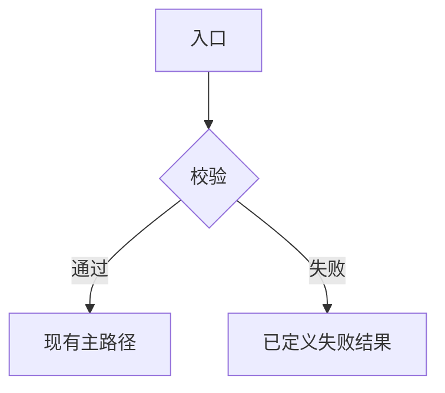

# 【一句话实现目标】

> 本文档是由 `$ai-plan-converter` 生成、供 `$ai-plan-executor` 执行的源码实施方案。
> 它不是面向人类做业务决策的原始方案，也不能替代人工确认。

## 方案元信息

| 项目 | 内容 |
| --- | --- |
| 方案名称 |  |
| 方案类型 | 功能代码开发 / 缺陷修复 / 代码重构 / UI 代码调整 / 服务代码改动 / 测试代码改动 |
| 风险等级 | 低 / 中 / 高 |
| 主要影响范围 | `path/or/module` |
| 是否允许改代码 | 是 / 否 |
| 是否允许改配置 | 是 / 否 |
| 是否允许新增测试 | 是 / 否 |
| 是否需要重启服务 | 是 / 否 / 待确认 |
| 来源决策方案 | `path/to/decision-plan.md` |
| 来源方案状态 | 已确认 |
| 转换状态 | 已转换 |
| 推荐执行 skill | `ai-plan-executor` |
| 角色策略 | 仅使用已解析角色目录中的 Role 索引，按 `阶段角色与职责` 逐阶段切换 |

## 目标

写清实现后最终可观察到的结果，包括输入、输出，以及失败时用户或调用方看到什么。

- 

## 背景与现状

只写来源决策方案确认的内容和代码阅读后核实的事实，并区分假设与偏差。

- 当前行为：
- 现有能力：
- 缺口：
- 关键代码 / 配置：`path` · `Type` · `function` / 配置键
- 相关业务对象、状态、不变量：
- 代码事实与来源方案的差异：

## 需求范围

只写必须实现的事。每条都应能映射到修改对象、实现步骤和验收标准。

- [ ] 
- [ ] 

## 非目标

明确禁止修改的内容，用于阻止无关重构、改协议、改权限、迁数据或扩大抽象。

- 
- 

## 执行约束

- 必须严格按本文档范围执行。
- 不允许进行方案外重构、统一格式化或无关清理。
- 不允许修改未列入修改范围的业务逻辑，除非实现步骤明确要求。
- 如果发现本文档与现有代码冲突，必须先停止并说明冲突，不得自行扩大范围。
- 如果实际代码结构与本文档预估文件不一致，必须先补充实际文件清单，再继续实现。
- 技术与工程规范以当前仓库、`AGENTS.md` 和对应 Stack 文档为准。
- 不得把来源决策方案中未确认的业务规则当作事实；需要时停止并请求 master 确认。
- 涉及配置、设备动作、数据库或调度逻辑时，必须保留回滚和人工验证说明。
- 【按任务增补硬规则，例如禁止改公共 API、禁止引入新依赖、必须走现有错误类型】

## 阶段角色与职责

角色是阶段局部指令，不是全文总人设。每个阶段开始时切换；阶段结束后不要把该角色视角带入下一阶段。

角色索引必须来自已解析角色目录，不能使用临时名称、显示名称或自行创造的角色。

| 阶段 | Role 索引 | 本阶段职责 | 输出重点 | 切换条件 |
| --- | --- | --- | --- | --- |
| 代码阅读阶段 | `developer` | 核对真实文件、调用链、类型、函数和冲突点 | 文件清单、调用链、冲突点 | 关键代码和配置已定位 |
| 修改前确认阶段 | `developer` | 核对需求范围、非目标、执行约束和来源方案偏差 | 未决冲突与待确认项 | 无未决冲突，或已请示 master |
| 实现阶段 | `developer` | 按修改范围做最小改动，保持现有代码风格 | 代码变更 | 代码改动完成 |
| 自检阶段 | `developer` | 对照验收标准和执行约束检查实现 | 自检表 | 自检完成 |
| 运行验证阶段 | `developer` | 执行本文指定的命令或操作并记录证据 | 验证记录 | 可运行项已完成 |
| 静态校验阶段 | `code-requirement-verifier` | 用代码证据核对需求完成度，不改代码 | 静态校验报告 | 结论明确 |
| 最终交付阶段 | `developer` | 按最终交付要求汇总实际结果和偏差 | 交付清单 | 文档齐全 |

## 实现方案

描述主路径、失败路径、状态/数据如何变化。这里只写实施框架，不贴最终生产代码。

- 入口：
- 主路径：
- 失败路径：
- 状态 / 数据如何变：
- 配置 / 持久化 / UI 刷新（如有）：
- 回滚方式：



## 修改范围

每个源文件都要落到类型和函数。没有函数时写 `不涉及函数`，并说明具体修改的类型、字段、导入、配置键或文档段落。路径未知时只能写模块，并在实现步骤中要求先定位准确文件。

| 文件或模块 | 修改类型 | 是否必须 | 涉及类/类型 | 涉及函数 | 修改目的 |
| --- | --- | --- | --- | --- | --- |
| `path/to/file` | 修改 / 新增 / 删除 / 待确认 | 必须 / 可选 | `TypeName` | `ExistingMethod`、`NewMethod`（新增） | 为什么要改 |

## 新增类与结构体设计

无新增类或结构体时必须保留以下内容：

无新增类或结构体

如有新增类型，先列出总表，再为每个类型写职责、生命周期和不可编译的框架级骨架。每个可调用成员还必须出现在 `函数级修改设计`。

| 文件 | 命名空间 | 类型名称 | 类型种类 | 可见性 | 基类/接口 | 核心职责 | 新增原因 |
| --- | --- | --- | --- | --- | --- | --- | --- |
| `path/to/NewType` | `module.path` | `NewType` | class / struct / type | public / internal | `Base` / 无 | 单一职责 | 为什么不能复用现有类型 |

#### `path/to/NewType` — `Namespace.NewType`

- 类型：class / struct / type
- 职责：
- 使用方：
- 生命周期：singleton / scoped / transient / value object / 手工管理
- 新增原因：

```text
type NewType
    dependencies:
        verified dependency contracts
    state:
        fields and ownership
    construction:
        inputs and invariants
    public surface:
        methods and responsibilities
    private helpers:
        helper names and boundaries
```

## 函数级修改设计

每个现有函数和新增函数都必须能回溯到 `修改范围` 中的文件。现有函数使用当前真实签名；新增函数的建议签名必须标明仍需代码核对的部分。

| 文件 | 类/类型 | 函数或成员 | 变更类型 | 建议签名 | 职责 | 调用关系 |
| --- | --- | --- | --- | --- | --- | --- |
| `path/to/file` | `TypeName` | `ExistingMethod` | 修改现有函数 | `ReturnType ExistingMethod(Args)` | 修改后的职责 | 由谁调用、调用谁 |
| `path/to/file` | `TypeName` | `NewMethod` | 新增函数 | `ReturnType NewMethod(Args)` | 新函数职责 | 由谁调用、调用谁 |

#### `path/to/file` — `TypeName.MethodName`

- 变更类型：修改现有函数 / 新增函数
- 目标：说明函数修改后的单一职责

```text
function MethodName(arguments):
    validate required inputs
    if guard condition fails:
        record or return the defined failure result
    call verified dependency
    update required state
    return result
```

## 实现步骤

每一步必须可执行，角色行只作用于该阶段。

### 1. 代码阅读阶段

当前 Role：`developer`

- 阅读 `修改范围` 中的文件、调用方、配置和相关测试。
- 确认真实签名、错误处理、状态转换、配置键与来源方案是否一致。
- 输出实际文件清单、调用链、代码事实和冲突点。

### 2. 修改前确认阶段

当前 Role：`developer`

- 对照 `需求范围`、`非目标`、`执行约束` 和来源决策方案。
- 对照实际代码确认每个修改对象存在且边界可行。
- 有未解决冲突时先停止，不开始改代码。

### 3. 实现阶段

当前 Role：`developer`

- 只修改 `修改范围` 中列出的文件、类型和函数。
- 按 `函数级修改设计` 的框架级伪代码实现，风格跟随仓库现有写法。
- 不新增方案外抽象，不把局部不确定性扩展成业务决策。

### 4. 自检阶段

当前 Role：`developer`

- 逐条检查 `验收标准`。
- 检查来源方案的目标、非目标和不变量是否仍然成立。
- 检查是否出现方案外重构、格式化、无关文件或行为变化。

### 5. 运行验证阶段

当前 Role：`developer`

- 只执行 `运行验证方式` 中与当前环境可用的命令或操作。
- 记录命令、输入、结果、失败原因和未执行项。

### 6. 静态校验阶段

当前 Role：`code-requirement-verifier`

- 按 `代码静态校验` 输出逐条校验报告。
- 本阶段只读复核，不修改代码。

### 7. 最终交付阶段

当前 Role：`developer`

- 按 `最终交付要求` 汇总实际修改、偏差、验证证据和剩余风险。

## 验收标准

全部写成可判断真假的条目，执行后只能标记：已满足 / 未满足 / 部分满足。

- [ ] 【输入 / 操作】时，【可观察结果】。
- [ ] 失败路径：【输入】时返回 / 显示【已有错误形状或文案】，且不产生【具体副作用】。
- [ ] 【状态、数据、接口或兼容性不变量】保持不变。
- [ ] 未列入范围的模块行为保持不变。

## 代码静态校验

主执行 agent 必须在实现后执行代码静态校验，并在最终交付中输出静态校验报告。

静态校验执行方式：

1. 逐条对照来源决策方案、本方案的方案元信息、需求范围、非目标、执行约束、实现步骤和验收标准，说明每项是否实现或遵守。
2. 标出每项对应的代码位置，至少精确到文件；关键逻辑精确到类、方法或配置键。
3. 沿真实调用链检查数据流、状态流、接口调用、配置读取、错误处理和返回结果。
4. 检查字段名、参数名、配置键、事件名、topic、返回结构是否前后一致。
5. 检查是否遗漏错误处理、空状态、权限、重复提交、并发、回滚、重启要求或兼容性处理。
6. 检查是否存在条件写反、默认值错误、状态未更新、异常被吞掉、资源未释放等明显逻辑错误。
7. 检查是否引入方案之外的重构、格式化、无关文件修改或行为变化。
8. 列出无法通过静态阅读确认、必须实际运行或联机验证才能确认的风险。
9. 给出最终结论：可以进入下一步 / 需要修改 / 必须运行验证后再判断。

静态校验报告模板：

| 检查项 | 结论 | 代码位置 | 说明 |
| --- | --- | --- | --- |
| 方案要求 1 | 已实现 / 未实现 / 部分实现 | `path/to/file` · `Type.method` |  |

无法静态确认的风险：

- 

最终结论：

- 结论：可以进入下一步 / 需要修改 / 必须运行验证后再判断
- 理由：

## 运行验证方式

只写本次改动真正能证明行为差的命令或操作，必须符合当前仓库和运行环境。

- 构建 / 类型检查：
- 聚焦测试：
- 手工路径（UI / 接口 / 日志）：
- 期望结果：
- 环境不可用时仍必须做的项：
- 必须等可运行环境才能做的项：

## 风险与假设

- 来源方案假设：
- 代码事实假设：
- 与来源方案的局部偏差：
- 静态无法确认：
- 必须运行才知道：
- 回滚方式：

## 最终交付要求

执行者必须输出：

1. 修改文件列表。
2. 实际新增类型列表，包括最终声明、职责以及与计划类型骨架的偏差；无新增则写无。
3. 每个文件实际修改和新增的函数列表，包括最终签名。
4. 每个文件、类型和函数的变更摘要，包括与计划伪代码框架的偏差。
5. 每条验收标准的结论：已满足 / 未满足 / 部分满足。
6. 来源决策方案的目标、非目标和不变量是否保持。
7. 执行约束遵守情况。
8. 阶段角色执行摘要，使用本文 Role 索引；若某阶段无法套用文档角色，必须写明。
9. 实际跑过的测试或验证命令，包括失败。
10. 若运行验证无法执行，说明原因。
11. 代码静态校验报告。
12. 剩余风险和手工检查。

## 执行入口提示

请使用 `$ai-plan-executor` 执行本文档，不要直接执行来源决策方案。

执行要求：

1. 先完整阅读本文档和 `来源决策方案`。
2. 确认来源方案状态为 `已确认`，本方案 `转换状态` 为 `已转换`。
3. 提取目标、方案元信息、需求范围、非目标、执行约束、修改范围、新增类与结构体设计、函数级修改设计和验收标准。
4. 提取 `阶段角色与职责` 中的 Role 索引，确认索引存在于角色目录，并在每个阶段开始时切换到该角色。
5. 实现前检查方案与现有代码是否冲突。
6. 严格按本方案修改，不做方案外重构。
7. 如果发现实际文件结构与方案不一致，先补充实际文件清单再继续。
8. 实现后必须执行代码静态校验。
9. 根据 `运行验证方式` 执行可运行的验证项。
10. 最终按 `最终交付要求` 输出结果，并说明阶段角色执行情况。
